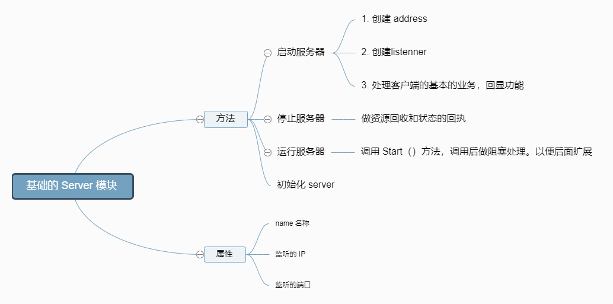

### 将完成 Zinx 框架的 server 模块。也就是实现如下图所示的功能模块：


### 知识点 
- 服务器基本知识
- 单元测试

### 初始化
为了更好的看到 Zinx 框架，首先我们需要构建 Zinx 的最基本的两个模块 `ziface` 和`znet`。

`ziface` 主要是存放一些 Zinx 框架的全部模块的抽象层接口类，Zinx 框架的最基本的是服务类接口 `iserver`，定义在 ziface 模块中。

`znet` 模块是 zinx 框架中网络相关功能的实现，所有网络相关模块都会定义在`znet`模块中。

我们通过在命令行中运行如下命令，进行初始化操作。
```
wget https://labfile.oss.aliyuncs.com/courses/1639/init.sh && /bin/bash init.sh
```
现在在我们的 src 目录下的文件路径如下：
```
.
├── init.sh
└── src
    └── zinx
        ├── ziface
        │   └── iserver.go
        └── znet
            └── server.go

4 directories, 3 files
```
在 ziface 下创建服务模块抽象层 iserver.go
作为接口，我们对外只提供方法，所以我们可以抽象为：

启动服务器方法。
停止服务器方法。
开启业务服务方法。
```go
package ziface
//定义服务器接口
type IServer interface{
    //启动服务器方法
    Start()
    //停止服务器方法
    Stop()
    //开启业务服务方法
    Serve()
}
```
#### 在 znet 下实现服务模块 server.go
我们这里使用 Server 结构体来实现上面接口中所定义的方法。首先，作为一个服务器，必须要有的三个属性就是：

 - 服务器名。
 - 服务器 IP。
 - 服务器监听的端口。
但是现在的 IP 地址不只有 IPv4 ，IPv6 也在推行当中了。所以我们还需要一个 IPversion 的属性来表示 IP 地址的版本。

所以，这个结构体定义如下：
```go
//iServer 接口实现，定义一个Server服务类
type Server struct {
    //服务器的名称
    Name string
    //tcp4 or other
    IPVersion string
    //服务绑定的IP地址
    IP string
    //服务绑定的端口
    Port int
}

/*
  创建一个服务器句柄
 */
func NewServer (name string) ziface.IServer {
    s:= &Server {
        Name :name,
        IPVersion:"tcp4",
        IP:"0.0.0.0",
        Port:7777,
    }
    return s
}
```
#### 启动服务器的实现
启动一个服务器分为三步：

获取 TCP 的地址。
监听服务器地址。
启动 server 网络连接业务。
实现过程如下：
```go
//开启网络服务
func (s *Server) Start() {
    fmt.Printf("[START] Server listenner at IP: %s, Port %d, is starting\n", s.IP, s.Port)
    //开启一个go去做服务端Linster业务
    go func() {
        //1 获取一个TCP的Addr
        addr, err := net.ResolveTCPAddr(s.IPVersion, fmt.Sprintf("%s:%d", s.IP, s.Port))
        if err != nil {
            fmt.Println("resolve tcp addr err: ", err)
            return
        }
        //2 监听服务器地址
        listenner, err:= net.ListenTCP(s.IPVersion, addr)
        if err != nil {
            fmt.Println("listen", s.IPVersion, "err", err)
            return
        }
        //已经监听成功
        fmt.Println("start Zinx server  ", s.Name, " succ, now listenning...")
        //3 启动server网络连接业务
        for {
            //3.1 阻塞等待客户端建立连接请求
            conn, err := listenner.AcceptTCP()
            if err != nil {
                fmt.Println("Accept err ", err)
                continue
            }
            //3.2 TODO Server.Start() 设置服务器最大连接控制,如果超过最大连接，那么则关闭此新的连接
            //3.3 TODO Server.Start() 处理该新连接请求的 业务 方法， 此时应该有 handler 和 conn是绑定的
            //我们这里暂时做一个最大512字节的回显服务
            go func () {
                //不断的循环从客户端获取数据
                for  {
                    buf := make([]byte, 512)
                    cnt, err := conn.Read(buf)
                    if err != nil {
                        fmt.Println("recv buf err ", err)
                        continue
                    }
                    //回显
                    if _, err := conn.Write(buf[:cnt]); err !=nil {
                        fmt.Println("write back buf err ", err)
                        continue
                    }
                }
            }()
        }
    }()
}
```

### 剩余两个方法的实现
这里，我们的 Stop 方法和 Serve 方法，只做出一个打印的功能。因为这些功能需要与其他功能相结合使用。

```go
func (s *Server) Stop() {
    fmt.Println("[STOP] Zinx server , name " , s.Name)
    //TODO：  Server.Stop() 将其他需要清理的连接信息或者其他信息 也要一并停止或者清理
}
func (s *Server) Serve() {
    s.Start()
    //TODO： Server.Serve() 是否在启动服务的时候 还要处理其他的事情呢 可以在这里添加
    //阻塞,否则主Go退出， listenner的go将会退出
    for {
        time.Sleep(10*time.Second)
    }
}
```

### 完整代码
```go
package znet
import (
    "fmt"
    "net"
    "time"
    "zinx/ziface"
)
//iServer 接口实现，定义一个Server服务类
type Server struct {
    //服务器的名称
    Name string
    //tcp4 or other
    IPVersion string
    //服务绑定的IP地址
    IP string
    //服务绑定的端口
    Port int
}
//============== 实现 ziface.IServer 里的全部接口方法 ========
//开启网络服务
func (s *Server) Start() {
    fmt.Printf("[START] Server listenner at IP: %s, Port %d, is starting\n", s.IP, s.Port)
    //开启一个go去做服务端Linster业务
    go func() {
        //1 获取一个TCP的Addr
        addr, err := net.ResolveTCPAddr(s.IPVersion, fmt.Sprintf("%s:%d", s.IP, s.Port))
        if err != nil {
            fmt.Println("resolve tcp addr err: ", err)
            return
        }
        //2 监听服务器地址
        listenner, err:= net.ListenTCP(s.IPVersion, addr)
        if err != nil {
            fmt.Println("listen", s.IPVersion, "err", err)
            return
        }
        //已经监听成功
        fmt.Println("start Zinx server  ", s.Name, " succ, now listenning...")
        //3 启动server网络连接业务
        for {
            //3.1 阻塞等待客户端建立连接请求
            conn, err := listenner.AcceptTCP()
            if err != nil {
                fmt.Println("Accept err ", err)
                continue
            }
            //3.2 TODO Server.Start() 设置服务器最大连接控制,如果超过最大连接，那么则关闭此新的连接
            //3.3 TODO Server.Start() 处理该新连接请求的 业务 方法， 此时应该有 handler 和 conn是绑定的
            //我们这里暂时做一个最大512字节的回显服务
            go func () {
                //不断的循环从客户端获取数据
                for  {
                    buf := make([]byte, 512)
                    cnt, err := conn.Read(buf)
                    if err != nil {
                        fmt.Println("recv buf err ", err)
                        continue
                    }
                    //回显
                    if _, err := conn.Write(buf[:cnt]); err !=nil {
                        fmt.Println("write back buf err ", err)
                        continue
                    }
                }
            }()
        }
    }()
}
func (s *Server) Stop() {
    fmt.Println("[STOP] Zinx server , name " , s.Name)
    //TODO  Server.Stop() 将其他需要清理的连接信息或者其他信息 也要一并停止或者清理
}
func (s *Server) Serve() {
    s.Start()
    //TODO Server.Serve() 是否在启动服务的时候 还要处理其他的事情呢 可以在这里添加
    //阻塞,否则主Go退出， listenner的go将会退出
    for {
        time.Sleep(10*time.Second)
    }
}
/*
  创建一个服务器句柄
 */
func NewServer (name string) ziface.IServer {
    s:= &Server {
        Name :name,
        IPVersion:"tcp4",
        IP:"0.0.0.0",
        Port:7777,
    }
    return s
}
```


### 入坑笔记
因为引用了本地的库
```
import (
    "fmt"
    "net"
    "time"
    "zinx/ziface" // 这行
)
```
所以
先看下gopath
```
go env
```
使用前将本地的库临时加进去
```
export GOPATH=$GOPATH:/Users/xxxx/project/go/my/zinx
```