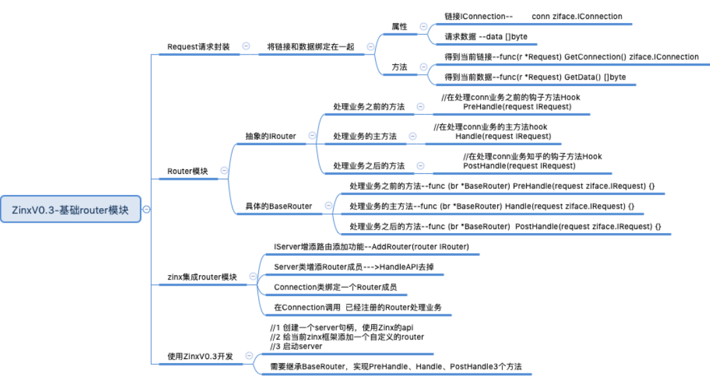
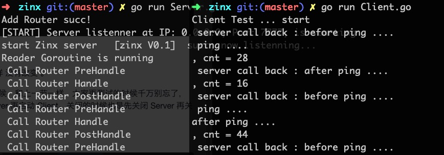

### 实验介绍
本节实验中，我们将完成 Zinx 框架的基础路由的模块。如下面的思维导图中所表示的这些功能。



### 知识点
路由功能模块

### 准备
现在我们就给用户提供一个自定义的 conn 处理业务的接口吧，很显然，我们不能把业务处理业务的方法绑死在type HandFunc func(*net.TCPConn, []byte, int) error这种格式中，我们需要定一些interface{}来让用户填写任意格式的连接处理业务方法。

那么，很显然 func 是满足不了我们需求的，我们需要再做几个抽象的接口类。

### IRequest 消息请求抽象类
我们现在需要把客户端请求的连接信息和请求的数据，放在一个叫 Request 的请求类里，这样的好处是我们可以从 Request 里得到全部客户端的请求信息，也为我们之后拓展框架有一定的作用，一旦客户端有额外的含义的数据信息，都可以放在这个 Request 里。可以理解为每次客户端的全部请求数据，Zinx 都会把它们一起放到一个 Request 结构体里。

##### 创建抽象 IRequest 层
在 ziface 下创建新文件 irequest.go。

zinx/ziface/irequest.go
```go
package ziface
// IRequest 接口：
//实际上是把客户端请求的链接信息 和 请求的数据 包装到了 Request里
type IRequest interface{
	GetConnection() IConnection //获取请求连接信息
	GetData() []byte //获取请求消息的数据
}
```
不难看出，当前的抽象层只提供了两个 Getter 方法，所以有个成员应该是必须的，一个是客户端连接，一个是客户端传递进来的数据，当然随着 Zinx 框架的功能丰富，这里面还应该继续添加新的成员。

##### 实现 Request 类
在 znet 下创建 IRequest 抽象接口的一个实例类文件 request.go

zinx/znet/request.go

```go
package znet
import (
	"zinx/ziface"
)

type Request struct {
	conn ziface.IConnection //已经和客户端建立好的 链接
	data []byte //客户端请求的数据
}

// 获取请求连接信息
func (r *Request) GetConnection() ziface.IConnection {
	return r.conn
}

// 获取请求消息的数据
func (r *Request) GetData() []byte {
	return r.data
}
```

### IRouter 路由配置抽象类
现在我们来给 Zinx 实现一个非常简单基础的路由功能，目的当然就是为了快速的让 Zinx 步入到路由的阶段。后续我们会不断的完善路由功能。
##### 创建抽象的 IRouter 层

我们知道 router 实际上的作用就是，服务端应用可以给 Zinx 框架配置当前链接的处理业务方法，之前的 Zinx-V0.2 我们的 Zinx 框架处理链接请求的方法是固定的，现在是可以自定义，并且有 3 种接口可以重写。

Handle：是处理当前链接的主业务函数

PreHandle：如果需要在主业务函数之前有前置业务，可以重写这个方法

PostHandle:如果需要在主业务函数之后又后置业务，可以重写这个方法

当然每个方法都有一个唯一的形参 IRequest 对象，也就是客户端请求过来的连接和请求数据，作为我们业务方法的输入数据。

```go
package ziface
/*
    路由接口， 这里面路由是 使用框架者给该链接自定的 处理业务方法
    路由里的IRequest 则包含用该链接的链接信息和该链接的请求数据信息
*/
type IRouter interface {
	PreHandle(request IRequest) //在处理conn业务之前的钩子方法
	Handle(request IRequest) //处理conn业务的方法
	PostHandle(request IRequest) //处理conn业务之后的钩子方法
}
```

##### 实现 Router 类
在 znet 下创建 router.go 文件
```go
package znet
import "zinx/ziface"

//实现router时，先嵌入这个基类，然后根据需要对这个基类的方法进行重写
type BaseRouter struct {}

//这里之所以BaseRouter的方法都为空，
// 是因为有的Router不希望有PreHandle或PostHandle
// 所以Router全部继承BaseRouter的好处是，不需要实现PreHandle和PostHandle也可以实例化
func (br *BaseRouter) PreHandle(req ziface.IRequest){}
func (br *BaseRouter) Handle(req ziface.IRequest){}
func (br *BaseRouter) PostHandle(req ziface.IRequest){}
```

### Zinx-V0.3-集成简单路由功能

##### IServer 增添路由添加功能
我们需要给 IServer 类，增加一个抽象方法 AddRouter,目的也是让 Zinx 框架使用者，可以自定一个 Router 处理业务方法。

zinx/ziface/iserver.go

```go
package ziface
// 定义服务器接口
type IServer interface {
	// 启动服务器方法
	Start()
	// 停止服务器方法
	Stop()
	// 开启业务服务的方法
	Serve()
	// 路由功能：给当前服务注册一个路由业务方法，供客户端链接处理使用
	AddRouter(router IRouter)
}
```

##### Server 类增添 Router 成员
有了抽象的方法，自然 Server 就要实现，并且还要添加一个 Router 成员.

zinx/znet/server.go
```go
//iServer 接口实现，定义一个Server服务类
type Server struct {
    //服务器的名称
    Name string
    //tcp4 or other
    IPVersion string
    //服务绑定的IP地址
    IP string
    //服务绑定的端口
    Port int
    //当前Server由用户绑定的回调router,也就是Server注册的链接对应的处理业务
    Router ziface.IRouter
}
copy

```

然后NewServer()方法， 初始化 Server 对象的方法也要加一个初始化成员

```go
/*
  创建一个服务器句柄
 */
func NewServer (name string) ziface.IServer {
    s:= &Server {
        Name :name,
        IPVersion:"tcp4",
        IP:"0.0.0.0",
        Port:7777,
        Router: nil,
    }
    return s
}
```
##### Connection 类绑定一个 Router 成员
zinx/znet/connection.go
```go

type Connection struct {
	// 当前链接的socket TCP套接字
	Conn *net.TCPConn
	// 当前连接的ID 也可以称为作为SessionID,ID全局唯一
	ConnID uint32
	// 当前连接的关闭状态
	isClosed bool
	// // 该连接的处理方法api
	// handleAPI ziface.HandFunc
	//该连接的处理方法router
	Router ziface.IRouter
	// 告知该连接已经退出/停止的channel
	ExitBuffChan chan bool
}
```

##### 在 Connection 调用注册的 Router 处理业务
zinx/znet/connection.go

这里我们在 conn 读取完客户端数据之后，将数据和 conn 封装到一个 Request 中，作为 Router 的输入数据。

然后我们开启一个 goroutine 去调用给 Zinx 框架注册好的路由业务。

```go
// 处理conn读数据的Goroutine
func (c *Connection) StartReader(){
	fmt.Println("Reader Goroutine is running")
	defer fmt.Println(c.RemoteAddr().String()," conn reader exit!")
	defer c.Stop()
	for{
		// 读取我最大的数据到buf中
		buf := make([]byte,512)
		cnt,err := c.Conn.Read(buf)
		if err != nil {
			fmt.Println("recv buf err",err)
			c.ExitBuffChan <- true
			continue
		}
		// 得到当前客户端请求的Request数据
		req := Request{
			conn: c,
			data: buf,
		}

		// 从路由Routers 中找到注册绑定Conn的对应Handle
		go func (request ziface.IRequest){
			// 执行注册的路由方法
			c.Router.PreHandle(request)
			c.Router.Handle(request)
			c.Router.PostHandle(request)
		}(&req)

		// // 调用当前链接业务（这里执行的是当前conn绑定的handle方法）
		// if err := c.handleAPI(c.Conn,buf,cnt); err != nil {
		// 	fmt.Println("connID",c.ConnID,"handle is error")
		// 	c.ExitBuffChan <- true
		// 	return
		// }
	}
}
```
zinx/znet/server.go
```go
//路由功能：给当前服务注册一个路由业务方法，供客户端链接处理使用
func (s *Server) AddRouter(router ziface.IRouter){
	s.Router = router
	fmt.Println("Add Router succ!")
}
```
```go
			//3.3 处理该新连接请求的 业务 方法， 此时应该有 handler 和 conn是绑定的
			dealConn := NewConnection(conn,cid,s.Router)
```

zinx/znet/conneciont.go
```go
// func NewConnection(conn *net.TCPConn,connID uint32,callback_api ziface.HandFunc) *Connection{
func NewConnection(conn *net.TCPConn,connID uint32,router ziface.IRouter) *Connection{
	c := &Connection{
		Conn: conn,
		ConnID: connID,
		isClosed: false,
		// handleAPI: callback_api,
		Router: router,
		ExitBuffChan: make(chan bool,1),
	}
	return c
}
```
```go
		// cnt,err := c.Conn.Read(buf)
		_,err := c.Conn.Read(buf)
```

##### 测试基于 Zinx 完成的服务端应用

Server.go

我们这里自定义了一个类似 Ping 操作的路由，就是当客户端发送数据，我们的处理业务就是返回给客户端"ping…ping..ping..", 为了测试，当前路由也同时实现了 PreHandle 和 PostHandle 两个方法。实际上 Zinx 会利用模板的设计模式，依次在框架中调用PreHandle、Handle、PostHandle三个方法。
```go
package main
import (
    "zinx/znet"
    "fmt"
    "zinx/ziface"
)

//ping test 自定义路由
type PingRouter struct {
    znet.BaseRouter  //一定要先基础BaseRouter
}

// test PreHandle
func (this *PingRouter) PreHandle(request ziface.IRequest){
    fmt.Println(" Call Router PreHandle")
    if _,err := request.GetConnection().GetTCPConnection().Write([]byte("before ping ....\n")){
        fmt.Println("call back ping err")
    }
}


// test Handle
func (this *PingRouter) Handle(request ziface.IRequest){
    fmt.Println(" Call Router Handle")
    if _,err := request.GetConnection().GetTCPConnection().Write([]byte(" ping ....\n")){
        fmt.Println("call back ping err")
    }
}

// test PostHandle
func (this *PingRouter) PostHandle(request ziface.IRequest){
    fmt.Println(" Call Router PostHandle")
    if _,err := request.GetConnection().GetTCPConnection().Write([]byte("after ping ....\n")){
        fmt.Println("call back ping err")
    }
}


//Server 模块的测试函数
func main() {
    //1 创建一个server 句柄 s
    s := znet.NewServer("[zinx V0.1]")
    s.AddRouter(&PingRouter{})
    //2 开启服务
    s.Serve()
}
```

##### 客户端应用测试程序
和之前的 Client.go 一样 没有改变 。

这里我们进行测试的时候，和上一节一样，大家再测试的时候千万别忘了，启动的时候先启动 Server 再启动 Client。关闭的时候也是先关闭 Server 再关闭 Client。

执行结果如下：

