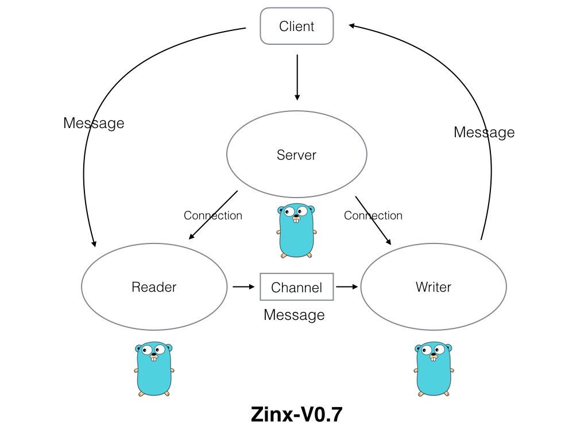

### 1.说明
本文档按照实验楼--Go 并发服务器框架 Zinx 入门的文档同步学习记录（大部分内容相同）
https://www.lanqiao.cn/courses/1639
主要有以下原因：
1、模仿大神写教程的风格
2、验证每一个步骤，而不是简简单单的复制教程中的代码。简单重现

### 2.实验介绍
接下来我们就要对 Zinx 做一个小小的改变，就是与客户端进修数据交互的 Gouroutine 由一个变成两个，一个专门负责从客户端读取数据，一个专门负责向客户端写数据。这么设计有什么好处，当然是目的就是高内聚，模块的功能单一，对于我们今后扩展功能更加方便。

#### 2.1.知识点
- Golang 并发模型
- 读写分离

#### 2.2.准备工作

我们希望 Zinx 在升级到 V0.7 版本的时候，架构是下面这样的：

Server 依然是处理客户端的响应，主要关键的几个方法是 Listen、Accept 等。当建立与客户端的套接字后，那么就会开启两个 Goroutine 分别处理读数据业务和写数据业务，读写数据之间的消息通过一个 Channel 传递。下面我们就开始进行实际的实现。

下面我们就开始实现 Zinx V0.7。

### 3.添加读写模块交互数据的管道
