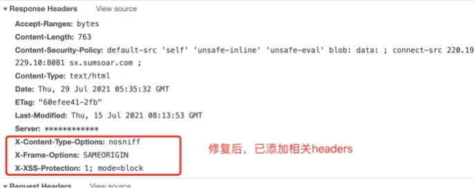
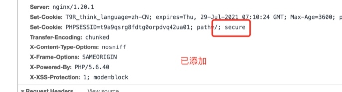
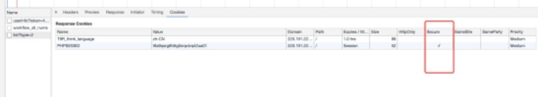
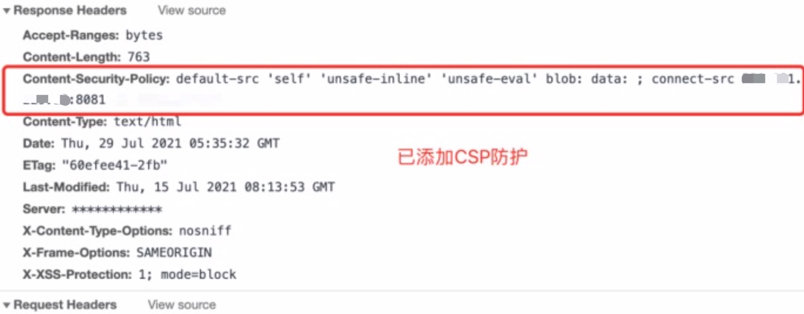

### 收到网站存在隐患的整改说明

#### 1.HTTP X-Content-Type-Options缺失

|          |	  说明     |    
| :-----:  |    :----:  |   
| 等级      |  低微      |
| 漏洞描述 |	弱点描述：通过设置"X-Content-Type-Options: nosniff"响应标头，对 script 和 styleSheet 在执行是通过MIME 类型来过滤掉不安全的文件。设置X-Content-Type-Options，可能导致IE9、IE11拒绝加载没有返回Content-Type的相关资源。 |     
| 加固建议 |  一般性的建议：响应中添加X-Content-Type-Options: nosniff。|

#### 参考：
https://blog.csdn.net/weixin_41986096/article/details/108319848

#### 修复过程
1、全局添加
在`/etc/nginx/nginx.conf`中的 http 中添加
```
add_header X-Frame-Options "SAMEORIGIN";
add_header X-XSS-Protection "1; mode=block";
add_header X-Content-Type-Options "nosniff";
``` 
X-Frame-Options： 响应头表示是否允许浏览器加载frame等属性，有三个配置DENY禁止任何网页被嵌入,SAMEORIGIN只允许本网站的嵌套,ALLOW-FROM允许指定地址的嵌套

X-XSS-Protection： 表示启用XSS过滤（禁用过滤为X-XSS-Protection: 0），mode=block表示若检查到XSS攻击则停止渲染页面

X-Content-Type-Options： 响应头用来指定浏览器对未指定或错误指定Content-Type资源真正类型的猜测行为，nosniff 表示不允许任何猜测

在通常的请求响应中，浏览器会根据Content-Type来分辨响应的类型，但当响应类型未指定或错误指定时，浏览会尝试启用MIME-sniffing来猜测资源的响应类型，这是非常危险的

例如一个.jpg的图片文件被恶意嵌入了可执行的js代码，在开启资源类型猜测的情况下，浏览器将执行嵌入的js代码，可能会有意想不到的后果

2、站点添加
在 zhandian.conf 中的 server 内添加
```
server {
    # HTTPS 默认443端口
    listen 443 ssl;
    # 证书文件配置，指定证书的路径，除了证书路径其他配置都默认
    ssl_certificate     /usr/local/nginx/ssl/server.crt;
    ssl_certificate_key /usr/local/nginx/ssl/server.key;
    ssl_protocols       TLSv1 TLSv1.1 TLSv1.2;
    ssl_ciphers         HIGH:!aNULL:!MD5:!DH;
    
    # host
    server_name example.com www.example.com;
    
    #设置长连接
    keepalive_timeout 70;    
    #减少点击劫持
    add_header X-Frame-Options DENY;
    #禁止服务器自动解析资源类型
    add_header X-Content-Type-Options nosniff;
    #防XSS攻击
    add_header X-XSS-Protection "1; mode=block";
    
    ……

}
```




#### 2.会话Cookie中缺少secure属性

|          |	  说明     |    
| :-----:  |    :----:  |   
| 等级      |  低微      |
| 漏洞描述   |  弱点描述：在应用程序测试过程中，检测到所测试的Web应用程序设置了不含“secure”属性的会话cookie。由于此会话cookie不包含“secure”属性，所以用户可以通过未加密的http协议传输Cookie,可能造成用户信息被窃听      |
|   加固建议  |  一般性的建议：[1]基本上，cookie的唯一必需属性是“name”字段，建议设置“secure”属性，以保证cookie的安全。		  |

#### 参考：
https://www.jianshu.com/p/a6ff1fd59e58

#### 修复过程
网站是PHP的，找到PHP的配置文件`/etc/php.ini`，搜索关键词`session.cookie_secure`，找到后先去掉`session.cookie_secure=`前面的` ；`然后加上`1`





#### 3.HTTP Content-Security-Policy缺失

|          |	  说明     |    
| :-----:  |    :----:  |   
| 等级      |  低微      |
| 漏洞描述   |  弱点描述：内容安全策略 (CSP) 是一个额外的安全层，用于检测并削弱某些特定类型的攻击，包括跨站脚本 (XSS) 和数据注入攻击等。无论是数据盗取、网站内容污染还是散发恶意软件，这些攻击都是主要的手段。CSP 的实质就是白名单制度，开发者明确告诉客户端，哪些外部资源可以加载和执行，等同于提供白名单。它的实现和执行全部由浏览器完成，开发者只需提供配置。CSP 大大增强了网页的安全。攻击者即使发现了漏洞，也没法注入脚本，除非还控制了一台列入了白名单的可信主机。CSP开启可能会导致js、css出现报错。 |
|   加固建议  |  一般性的建议：启用 CSP方法：一种是通过 HTTP 头信息的Content-Security-Policy的字段，另一种是通过网页的meta标签。|

#### 参考：
https://blog.csdn.net/kzhzhang/article/details/116451031
https://cloud.tencent.com/developer/section/1189856

#### 修复过程

##### 第一种：修改 nginx 配置文件
在对应站点`zhandian.conf` 配置文件中，增加如下配置内容：
```
add_header Content-Security-Policy "default-src 'self' 'unsafe-inline' 'unsafe-eval' blob: data: ;  connect-src 127.0.0.1:8081 www.test.com";
```
##### 第二种：通过网页的meta标签
```
<meta http-equiv="Content-Security-Policy" content="style-src 'self' 'unsafe-inline';script-src 'self' 'unsafe-inline' 'unsafe-eval' https://webapi.amap.com https://restapi.amap.com https://vdata.amap.com https://appx/web-view.min.js;worker-src blob:">
```
该指令说明：允许自身css、js和高德地图api、地图数据


