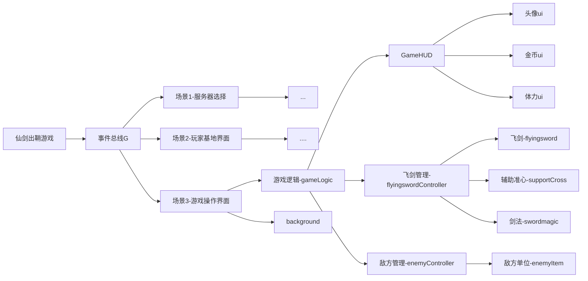

### 说明
之前使用的是别人的框架，里面一些东西都帮你“框”好了，没法增进自己对cocos框架的了解，也不利于cocos框架的升级

自己重新按照官方文档写游戏，当随着游戏复杂度的提升，一些规范需要得到约定，方便后续的拓展和维护。

### 面向事件开发

目前游戏的整个机制已 “面向事件开发”为主。

```mermaid

    graph LR
    
    仙剑出鞘游戏--> 事件总线G
    
    事件总线G-->  场景1-服务器选择
    事件总线G-->  场景2-玩家基地界面
    事件总线G-->  场景3-游戏操作界面
    
    场景1-服务器选择 -->  ...
    场景2-玩家基地界面 -->  ....
    
    场景3-游戏操作界面 -->  游戏逻辑-gameLogic
    场景3-游戏操作界面 -->  background
    游戏逻辑-gameLogic -->  GameHUD
    
    游戏逻辑-gameLogic -->  飞剑管理-flyingswordController
    
    游戏逻辑-gameLogic -->  敌方管理-enemyController
    
    飞剑管理-flyingswordController --> 飞剑-flyingsword
    飞剑管理-flyingswordController --> 辅助准心-supportCross
    飞剑管理-flyingswordController --> 剑法-swordmagic
    
    敌方管理-enemyController --> 敌方单位-enemyItem
    
    GameHUD --> 头像ui
    GameHUD --> 金币ui
    GameHUD --> 体力ui


```