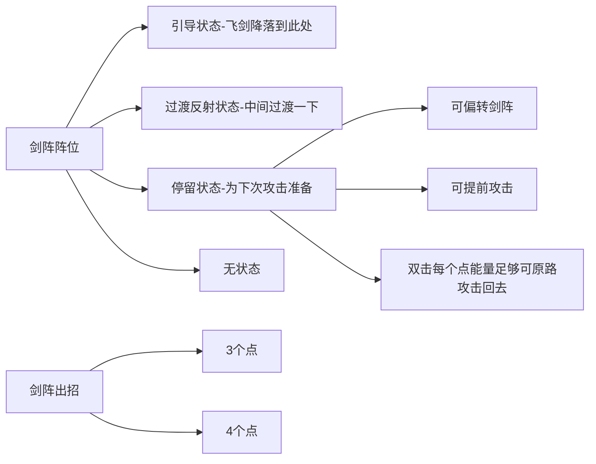

#### point有以下几种状态

```mermaid 
graph LR

    剑阵阵位 --> 引导状态-飞剑降落到此处
    剑阵阵位 --> 过渡反射状态-中间过渡一下
    剑阵阵位 --> 停留状态-为下次攻击准备
    剑阵阵位 --> 无状态


    停留状态-为下次攻击准备--> 可偏转剑阵
    停留状态-为下次攻击准备--> 可提前攻击
    停留状态-为下次攻击准备--> 双击每个点能量足够可原路攻击回去
    
    
    
    剑阵出招 --> 3个点
    剑阵出招 --> 4个点
    
    
    
```

