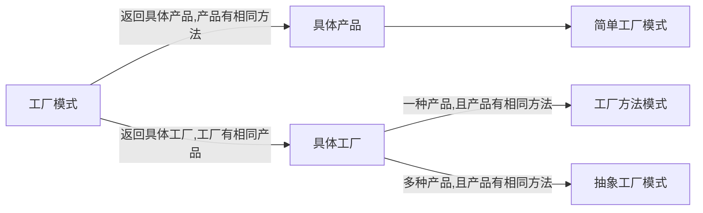
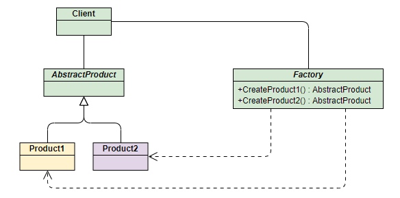
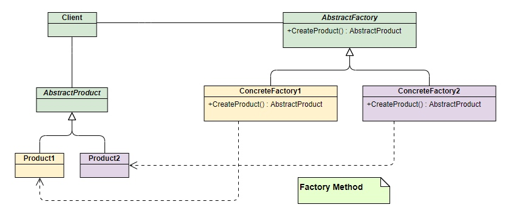
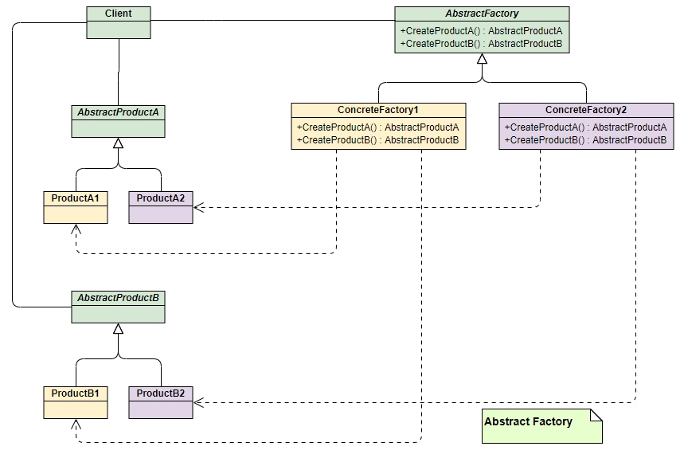

#### 工厂

###### 工厂模式 ==>  创建产品模式

根据直接生产产品，还是通过“外加工工厂”生产产品，可以分为“简单工厂模式”，“工厂方法模式”，“抽象工厂模式”，具体下如图


#### 简单工厂模式


手机代工厂
```php
<?php declare(strict_types=1);


class PhoneFactory
{
    // 简单工厂
    public function makeMiPhone(){
        return new MiPhone(); 
    }
    public function makeIPhone(){
        return new IPhone();
    }
    // 这种传参的方式又被取名为”静态工厂“
    public function makePhone(string $name){
        if($name == 'MiPhone'){
            return new MiPhone();
        }
        if($name == 'IPhone'){
            return new IPhone();
        }
    }
    
}
```
手机
```php
<?php

interface Phone
{
    public function callout(string $name); // 呼叫
    public function sendMsg(string $msg); // 发送消息
}
```
小米手机
```php
<?php

class MiPhone implements Phone
{
    public function callout(string $name)
    {
        var_dump('MiPhone callout');
    }
    public function sendMsg(string $msg)
    {
        var_dump('MiPhone sendMsg');
    }
}
```
苹果手机
```php
<?php

class IPhone implements Phone
{
    public function callout(string $name)
    {
        var_dump('IPhone callout');
    }
    public function sendMsg(string $msg)
    {
        var_dump('IPhone sendMsg');
    }
}
```
演示
```php
<?php

 $factory = new PhoneFactory();
 $miPhone = $factory->makeMiPhone();    // 简单工厂
 $iPhone = $factory->makeIPhone();      // 简单工厂
 $iPhonePro = $factory->makePhone("IPhone"); // 静态工厂
 
 // 无论是简单工厂或者是静态工厂，我们的侧重点是它们生产的产品都有相同的方法
 $miPhone->callout('张三');
 $miPhone->sendMsg('大家好');
 $iPhone->callout('张三');
 $iPhone->sendMsg('大家好');
 $iPhonePro->callout('张三');
 $iPhonePro->sendMsg('大家好');
```


#### 工厂方法模式(Factory Method)



工厂的抽象类
```php
<?php

interface AbstractFactory
{
    public function makePhone();
}
```
小米手机工厂
```php
<?php

class XiaoMiFactory implements AbstractFactory
{
    public function makePhone()
    {
        return new MiPhone();
    }
}
```
苹果手机工厂
```php
<?php

class AppleFactory implements AbstractFactory
{
    public function makePhone()
    {
        return new IPhone();
    }
}
```
演示
```php
<?php

 $xiaomifactory = new XiaoMiFactory();
 $applefactory = new AppleFactory();

 // 我们的侧重点是这些工厂有一种相同的产品，且产品有相同的方法
 $miPhone = $xiaomifactory->makePhone();
 $iPhone = $factory->makePhone();

```

### 抽象工厂模式(Abstract Factory)


小米工厂
```php
<?php

class XiaoMiFactory implements AbstractFactory
{
    public function makePhone()
    {
        return new MiPhone();
    }
    public function makePC()
    {
        return new MiPC();
    }
}
```
苹果工厂
```php
<?php

class AppleFactory implements AbstractFactory
{
    public function makePhone()
    {
        return new IPhone();
    }    
    public function makePC()
    {
        return new Mac();
    }
}
```

演示
```php
<?php

public function start(){
    $appleFactory = new AppleFactory();
    $xiaomiFactory = new XiaoMiFactory();
    // 我们的侧重点是这些工厂有多种相同的产品，且产品有相同的方法
    $this->doJob($appleFactory);
    $this->doJob($xiaomiFactory);
}

public function doJob($factory){
    $myPhone = $factory->makePhone();
    $myPC = $factory->makePC();
    $myPhone->sendMsg('大家好');
    $myPC->sendMsg('大家好');
}

```