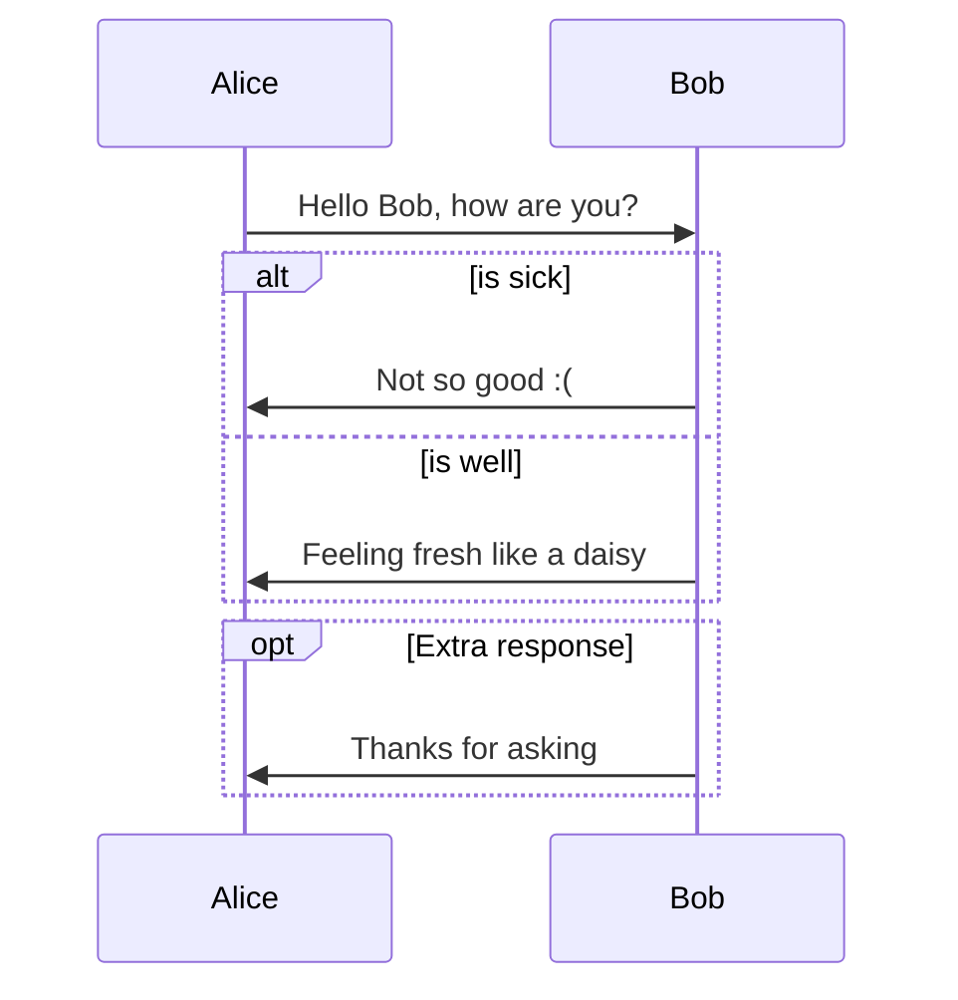
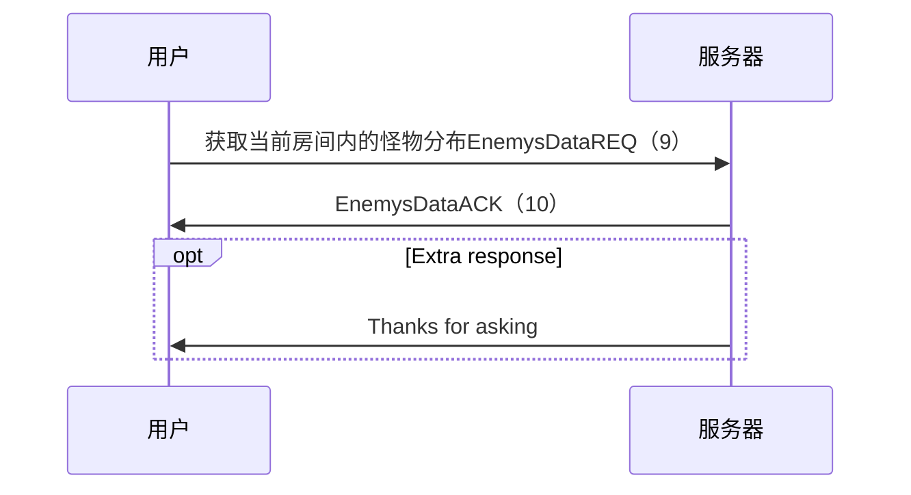

### 功能列表
 - [x] 微信登录获取用户信息
     - [x] 获取token
 - [x] websocket长连接
     - [x] arraybuffer消息互通
     - [x] 断线重连
 - [x] websocket聊天
     - [x] 消息的发送
         - [x] 服务端的广播（ChatACK）
         - [x] 客户端的发送（ChatREQ）
             - [x] 发送Test
             - [x] ui点击发送
     - [x] 消息的接收
         - [x] 服务端的接收（ChatREQ）
         - [x] 客户端的接收（ChatACK）
             - [x] 接收Test
             - [x] ui展示接收信息
 - [x] websocket发送玩法指令
     - [x] 指令的发送
         - [x] 服务端指令的广播(FireACK)
         - [x] 客户端的发送（FireREQ）
             - [x] 发送Test
             - [x] ui点击发送
     - [x]指令的接收
         - [x] 服务端的接收（FireREQ）
         - [x] 客户端的接收（FireACK）
             - [x] 接收Test
             - [x] ui展示接收效果
    - [ ] 动画播放指令
        - [x] 出鞘
        - [x] 运行轨迹
        - [ ] 回收入鞘
 - [x] 去掉一些以往的东西
     - [x] 去除init，用start和reset作为代替
     - [x] 去除 APP 的旧变量
     - [x] 单例全部继承baseCompoent
 - [x] 加上UImanager
     - [x] 将以前的改成新的UImanager模式
 - [x] 判断是否在四边形内
     - [x] 怪物坐标的服务端管理
     - [x] 判断是否在四边形内的算法
     - [x] 击中扣减血量，每段内一次性伤害一次触发
 - [ ] 剑阵盘玩法
     - [x] 剑属性（type）的玩法
         - [ ] 属性有自己当前的剑决定
         - [x] 属性分5种，金木水火土
         - [ ] 带有附加属性：伤害加成，其他buff
     - [x] 伤害的玩法
         - [x] 路径攻击
             - [x] 在攻击路径内的受到伤害
             - [x] 触发条件：不同属性的组合
             - [x] 延迟攻击：无
         - [x] 区域攻击
             - [x] 在攻击区域内的受到伤害
             - [x] 触发条件:同属性的闭合组合
             - [x] 延迟攻击：区域伤害
         - [x] 回路攻击
             - [x] 在攻击路径完毕后，原路返回攻击路径
             - [x] 触发条件:同属性的非闭合组合
             - [x] 延迟攻击：路径攻击加倍
     - [ ] 伤害结算
         - [ ] 飞剑基础攻击 + 加成攻击
         - [ ] 属性攻击（相克不叠加，克制叠加）
     - [ ] ~~破绽点（power）玩法~~【下个版本考虑】
         - [ ] ~~同一个关卡，所有玩家的怪物破绽点都一致~~
         - [ ] ~~一个回合后，会更新破绽点的分布（固定或者按照一定规律）~~
 - [x] 伤害，特效的播放显示
     - [x] 伤害扣血
     - [x] 特效数字
 - [x] 每个回合，更新怪物坐标
     - [ ] 如果怪物坐标大于最低点，更新关卡
     - [ ] 
 - [ ] 10个关卡
 - [ ] point连线


### 2.21
1、完成数据的双向绑定的研究

### 2.22
1、完成 特效数字 ，bmfont的插件使用
2、血量减少的bug

### 2.23
无

### 2.24
1、回路攻击
2、属性分5种，金木水火土
3、每个回合，更新怪物坐标

### 2.25
无

### 3.1
```
     在assets/Script/protocol/lobby.proto下定义结构
```
```
     protoc --php_out=./ *.proto
```
```
rm -rf ~/website/my/xianjian_pro/xianjian.jk-kj.com/Proto/GPBMetadata
mv -i GPBMetadata  ~/website/my/xianjian_pro/xianjian.jk-kj.com/Proto/
```
```
     rm -rf ~/website/my/xianjian_pro/xianjian.jk-kj.com/Proto/Msg
     mv -i Msg/ ~/website/my/xianjian_pro/xianjian.jk-kj.com/Proto/
```
```
     rm -rf ~/website/my/xianjian_pro/xianjian.jk-kj.com/Proto/Goodsmsg/
     mv -i Goodsmsg/ ~/website/my/xianjian_pro/xianjian.jk-kj.com/Proto/
```
```
     pbjs -t static-module -w commonjs -o protocol.js lobby.proto
```
```
     pbjs -t static-module -w commonjs -o goods.js goods.proto
```
```
// var $protobuf = require("protobufjs/minimal");
var $protobuf = window.protobuf;
```
```
     pbts -o protocol.d.ts protocol.js
```
```
     pbts -o goods.d.ts goods.js
```



攻击



### 6.20
